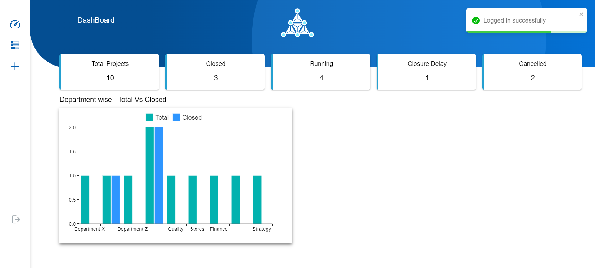

Project Management System
A simple project management system built using React, Node.js, and MongoDB. This application allows users to manage projects with functionalities like authentication, adding project details, listing and searching projects, sorting, pagination, updating project status, and viewing dashboard statistics.

Features
Login with Authentication: Secure login using JWT token authentication.
Insert Project Details: Add new projects with relevant information.
List Project Details: View all projects in a tabulated format.
Search a Project: Search projects based on keywords.
Sort the List: Sort project list by selected columns from a dropdown.
Pagination: Paginate the project list for better navigation.
Update Project Status: Update the status of existing projects.
Dashboard: View overall project statistics.
Cards to Show Status Counters: Display status counters in card format.
Graph to Show Department Wise Project Completion Report: Visualize project completion data with a department-wise graph.
Technologies Used
Frontend: React, HTML, CSS, MUI
Backend: Node.js
Database: MongoDB
Authentication: JWT Token
Installation
Clone the repository
bash
Copy code
git clone https://github.com/yourusername/project-management-system.git
Navigate to the project directory
bash
Copy code
cd project-management-system
Install dependencies for the frontend and backend
bash
Copy code
cd client
npm install
cd ../server
npm install
Set up environment variables
Create a .env file in the server directory with the following:

env
Copy code
PORT=5000
MONGO_URI=your_mongo_db_connection_string
JWT_SECRET=your_jwt_secret_key
Start the backend server
bash
Copy code
cd server
npm start
Start the frontend
bash
Copy code
cd client
npm start
Usage
Login

Users can log in using their credentials. JWT tokens will be used for secure authentication.

Add Project

Navigate to the "Add Project" page to input and save new project details.

View Projects

List all projects with options to search, sort, and paginate.

Update Status

Update the status of any project by selecting it from the list.

Dashboard

View key project statistics on the dashboard, including status counters and department-wise project completion graphs.

Screenshots
Login Page

Project List

Add Project

Dashboard

Contributing
Contributions are welcome! Please fork the repository and submit a pull request for review.
